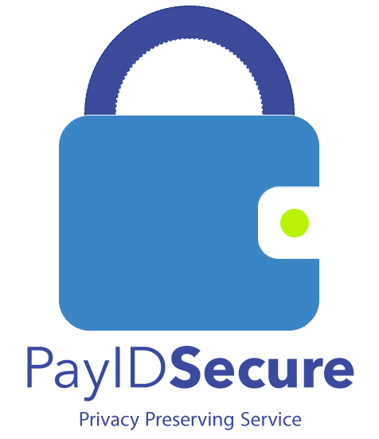
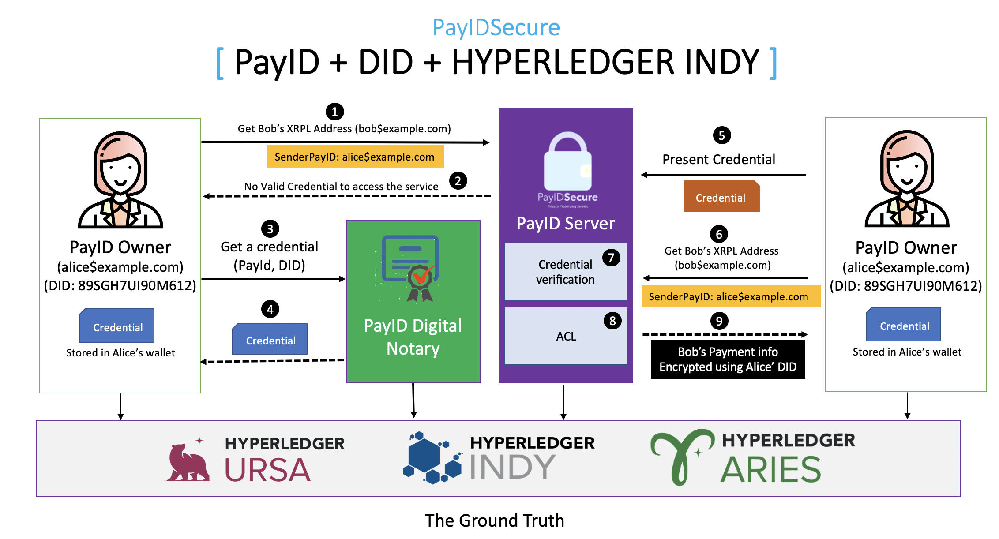

# PayIDSecure
Privacy Preserving Service

PayIDSecure is an extended version of the [@PayID](https://github.com/payid-org/payid) server with novel features of Access Contorl List (ACL) and decentrialized  idenitiy (DiD). The integration of DID and ACL to the PayID protocol provide more privacy and security to users. All such these extension have been integrated while we keep in mind the spirit of PayID “Make money move like email”.

This work has been developed in the context of [@PayID Hackathon 2020](https://payid.devpost.com/)
  


## Installation

0. Install prerequisites
   - docker engine
   - docker compose
   - nodejs

1. Get a copy of the reprository
```sh
git clone git@github.com:wshbair/PayIDSecure.git
```

2. Build and Run the Von-network (a portable development level Indy Node network):

```sh
cd von-network
./manage build
./manage up
```

3. Build and Run the PayID Server
```sh
cd PayIDServer
npm install
npm run devEnvUp
```

4. Build and Run the Agents and Controllers
```sh
cd docker
./run_demo webstart -l
```
5. To stop all:
```sh
cd PayIDSecure (project root)
./stop_demo
```
6. All subsequent runs can be performed with only one script, which should start all components:
```sh
cd PayIDSecure (project root)
./run_demo
```

## System Components 
PayID secure has been developed on the shoulders of two components: 
- [Hyperledger Indy](https://github.com/bcgov/von-network) provides the decentralized identity technology, and acts like the source of trust. We developed the required agents and controllers, thanks for [Hyperledger Aries Cloud Agent - Python](https://github.com/petridishdev/aries-cloudagent-python) demo for enlightening the road.
- [@PayID](https://github.com/payid-org/payid) provide the storage and management of users payment information and the corresponding PayID. 



## How does it work
After the installation open three browser windows/tabs and follow the instructions:
- Alice Dashboard http://localhost:3333
- PayID Server dashboard http://localhost:3000
- PayID Notary dashboard http://localhost:3500

## Demo Instructions: 
The recorded [Demo](https://youtu.be/nrej87tb7zQ?t=515) shows the exact steps, here we give some highlights to the main steps:

- Builds secure channels between the 3 components; [PayID Notary](http://localhost:3500), [PayID Server](http://localhost:3000 ) and [Alice](http://localhost:3333).
- Create new DID in [Alice dashboard](http://localhost:3333). , and publish it to the ledger, keep the value of DID in clipboard (i.e COPY). 
- Move to [PayID Notary dashboard](http://localhost:3500) to ownership credential, fill the form with the copied DID and press issue credential.
- Back to [Alice dashboard](http://localhost:3333) and check the Ownership Credentials, and press on the button Present to PayID server. The PayID server will send a request of proof of Alice credentail.
- Still in [Alice dashboard](http://localhost:3333) move to PayID&DID Operation and press on Get payment info to be able to get Bob payment information.


## Live Demo
The Demo is currently live and set. Alice,  PayID Server, and the PayID Digital Notary web GUIs are accessible at the following addresses:
   - http://3.122.8.207:3333/
   - http://3.122.8.207:3000/
   - http://3.122.8.207:3500/

Skipping ahead, the end result of Alice's query for Bob can be seen by pressing the button "Get Payment Information" at the address below:

    - http://3.122.8.207:3333/ids/req-pay-info


## Contributors 
- Dr. Wazen Shbair [@wshbair](https://github.com/wshbair) 
- Lucian TRESTIOREANU [@treisto](https://github.com/treisto )
- Flaviene SCHEIDT [@FlavScheidt](https://github.com/FlavScheidt)
